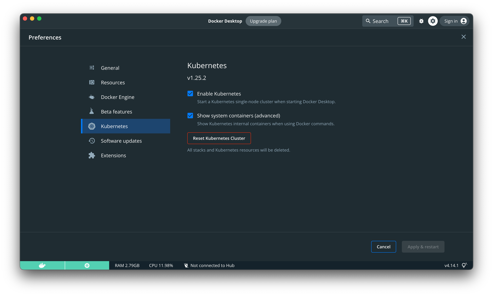
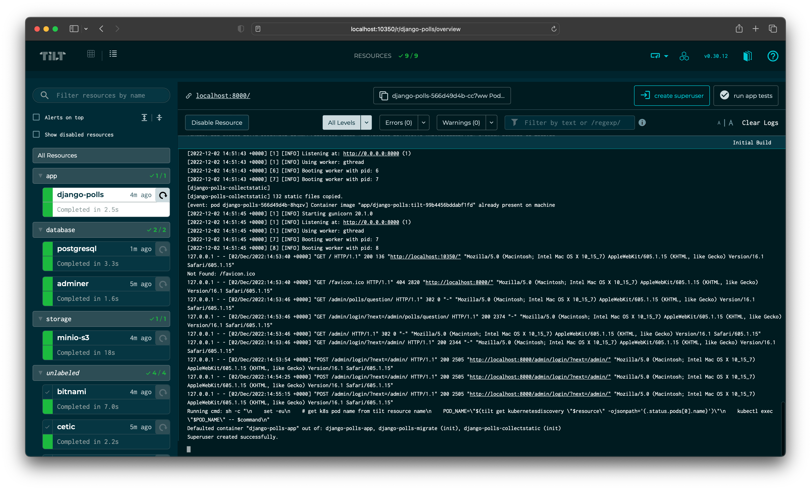
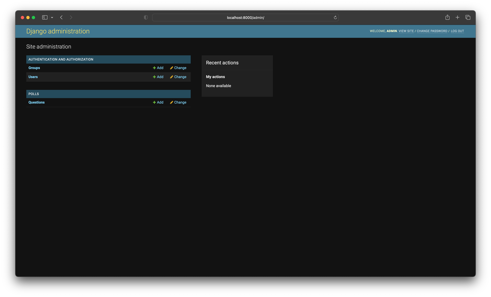
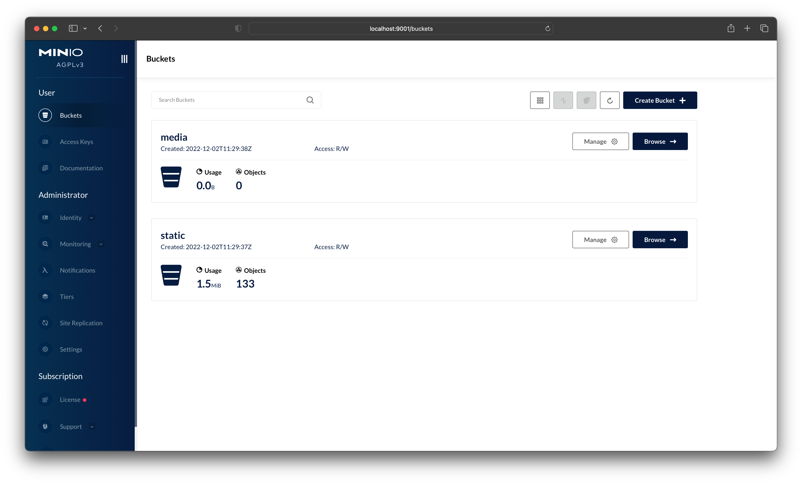
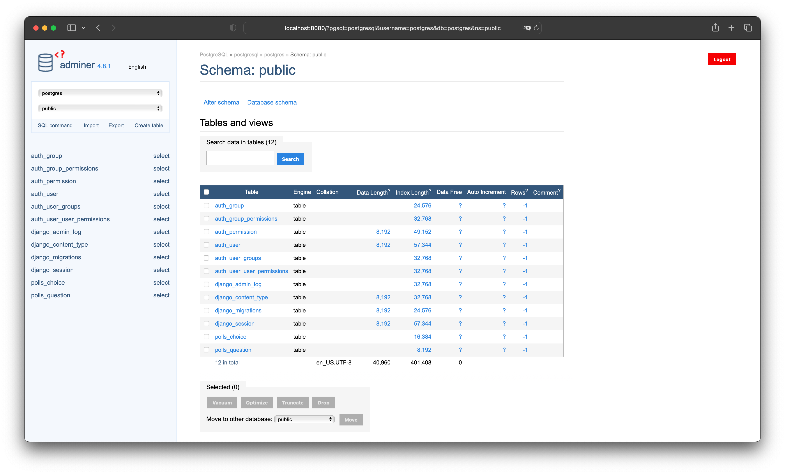

# Django (polls app) development in Kubernetes using Tilt with PostgreSQL, Adminer and MinIO installed using Helm.

Sample Django project demonstrating how to use Tilt with Helm to develop a Django application in Kubernetes. This project uses the [polls app](https://docs.djangoproject.com/en/4.1/intro/tutorial01/) from the Django documentation and is configured to use PostgreSQL and MinIO as the database and file storage backend respectively.

### Step 1 - Start the local Kubernetes cluster from Docker Desktop
Go to Docker Desktop > Preferences > Kubernetes > Enable Kubernetes and click Apply & Restart



### `Optional` Step 2 - Set the kubectl context to Docker Desktop
If you have multiple kubectl contexts, you can set the current context to Docker Desktop using the following command:
```bash
kubectl config get-contexts
kubectl config use-context docker-desktop
```

### Step 3 - Install Tilt for macOs (if not already installed)
Follow the instructions on the [Tilt website](https://docs.tilt.dev/install.html) to install Tilt.
```bash
brew install tilt-dev/tap/tilt
```

### Step 4 - Local development using Tilt
```bash
# Clone the repository
git clone https://github.com/garis-space/django-polls-app-tilt-k8s-pg-minio.git
cd django-polls-app-tilt-k8s-pg-minio

# Environment variables (edit as needed)
cp .env.example .env
```

When you run `tilt up` for the first time, Tilt will read .env file, set the environment variables and create secrets in the cluster for the Django app, PostgreSQL and minIO, then install Helm charts for PostgreSQL (with simple [adminer database management](https://www.adminer.org/)), MinIO (with init buckets) and deploy the Django application (migrations and collectstatic will be run automatically) using previously created secrets to the local Kubernetes cluster. This will take a few minutes. Subsequent runs of `tilt up` will be much faster.

```bash
# Start Tilt
tilt up
```

### Step 5 - Create a new superuser
From Tilt UI (http://localhost:10350), click from the left sidebar "django-polls" resource and then click the "create super user" button. This will create a new super user for the Django admin site with password from the `DJANGO_SUPERUSER_PASSWORD` environment variable.



### Step 6 - Access the Django admin site
You can access the Django admin site at https://localhost:8000/admin. Login using the username and password from the `DJANGO_SUPERUSER_USERNAME` and `DJANGO_SUPERUSER_PASSWORD` environment variables.



### Step 7 - Access the MinIO Console
You can access the MinIO Console at https://localhost:9001. Login using the username and password from the `MINIO_ROOT_USER` and `MINIO_ROOT_PASSWORD` environment variables.



### Step 8 - Access the Adminer PostgreSQL database management
You can access the Adminer PostgreSQL database management at https://localhost:8080. Login using the username and password from the `POSTGRESQL_USER` and `POSTGRESQL_PASSWORD` environment variables.



### Step 9 - Stop Tilt
Tilt will remove the Helm charts, secrets and the Django application from the local Kubernetes cluster.
```bash
tilt down
```
